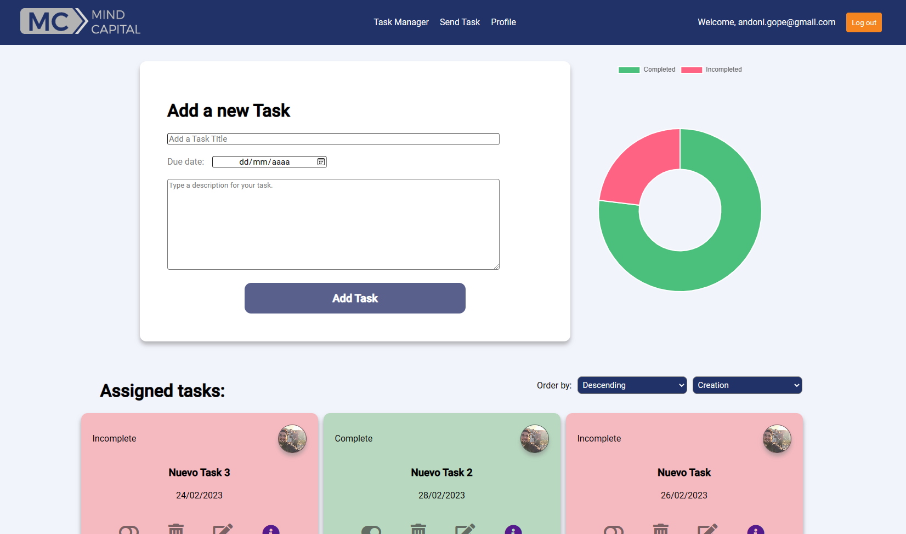

<!-- PROJECT LOGO -->
 

  
  <h3 align="center">Mind Capital - Task Manager</h3>
  <a href="https://final-project-ironhack-seven.vercel.app/auth/login">Visit Website</a>

<!-- ABOUT THE PROJECT -->

## Acerca del Proyecto

Información general del proyecto:

 - Se desarrollo una plataforma digital, en la cual el usuario puede registrar tareas por hacer y enviar tareas a otros usuarios registrados en la plataforma.
 - La plataforma permite editar, eliminar, cambiar el status de las tareas pendientes.
 - Para el desarrollo de la plataforma se utilizo el framework VUE.js, respaldado en github y el deploy fue hecho con vercel.
 - Las funcionalidades principales son: 
    - Registrar tareas propias.
    - Enviar tareas a otros usuarios.
    - Editar tareas.
    - Eliminar tareas.
    - Cambiar status de la tarea.
    - Revisar a detalle las tareas.
    - Llevar tracking de las tareas enviadas.
    - Llevar tracking de las tareas propias por realizar.
    - Editar perfil del usuario.
 - El proyecto fue asesorado y revisado por expertos de IronHack (Diego Zito, Carlos Garrido (AKA Jarko), Aleix Abuli)

(<a href="#readme-top">back to top</a>)

### Construido Con

 - Lenguajes de programación: HTML , CSS , JavaScript en framework VUE.js
 - Contol de versiones: GitHub, Vercel
 - Desarrollado localmente con: Microsoft Visual Code.

(<a href="#readme-top">back to top</a>)

## Roadmap

#### Backlog

- [ ] Ej - Tarea a completar y mover a su respectivo dia de ejecucion

#### Day One
###### Martes 07, Febrero 2023
- [x] Creación y configuración del git.
- [x] Análisis de estructura del sitio.
- [x] Signup conectado a Supabase.
- [x] Login funcional.
- [x] Logout funcional.
- [x] Display de tareas con fetch de supabase.
- [x] Actualización de status de tarea.
- [x] Funcionalidad de borrar tareas.

#### Day Two
###### Miercoles 08, Febrero 2023
- [x] Editar tarea.
- [x] Display only tasks corresponding to loggedin user.
- [x] Insertar iconos.
- [x] Restructura de home.
- [x] Alerta de sonido en modificación y creación de tarea.
- [x] Modificación del login.

#### Day Three
###### Jueves 09, Febrero 2023
- [x] Funcionalidad de accounts.
- [x] Estilamiento de accounts.
- [x] Tabla de perfiles en supabase.
- [x] Formato de footer.
- [x] Formato condicional de task cards por status.

#### Day Four
###### Viernes 10, Febrero 2023
- [x] Formato condicional de task cards por status.
- [x] Revisar el deploy de Vercel.
- [x] Modificación de Imagen de perfil
- [x] Sondear la posibilidad de crear el envío de tasks.

#### Day Five
###### Lunes 20, Febrero 2023
- [ ] Conectar gráfica de status.
- [x] Hamburguer Menu.
- [ ] Confirm email con redirección al sign in.
- [x] Rediseño de footer.

#### Day Six
###### Martes 21, Febrero 2023
- [x] Conectar gráfica de status.
- [x] Confirm email con redirección al sign in.

#### Day Seven
###### Miercoles 22, Febrero 2023
- [ ] Posibilidad de generar alertas por correo tras ser asignado una tarea.
- [x] Crear un filtro al mostrar las tareas en home.

#### Day Eight
###### Jueves 23, Febrero 2023
- [x] Últimas revisiones de funcionalidad.
- [x] Últimas revisiones vs MVP (Rúbrica Ironhack).
- [x] Redacción completa del README.

(<a href="#readme-top">back to top</a>)

<!-- Acerca de mi -->

## Acerca

Acerca del equipo de desarrollo:

  - Andoni Goicoechea Pederzini. andoni.gope@gmail.com
  - Frontend developer.
  - Master Big Data Analytics and Technologies.
  - 5 años de experiencia.

Project Link: [https://github.com/andonigp/ironhack-midterm]

(<a href="#readme-top">back to top</a>)

<!-- ACKNOWLEDGMENTS -->

## Agradecimientos

 - Agradecimientos:
    - Diego Zito - Lead Teacher
    - Carlos Garrido (Jarko) - Teacher Assistant
    - Aleix Abuli - Teacher Assistant.
 - Agradecimiento a IronHack.   

(<a href="#readme-top">back to top</a>)

